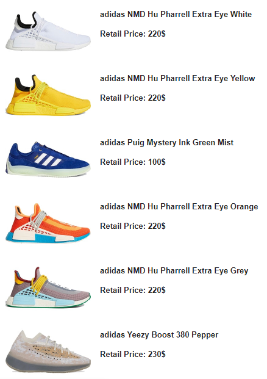

# Sneaker_Releases

## Overview
This is an script that fetches new sneaker releases for today's date and sends new releases to desired email. 
These sneakers can be filtered by editing settings.json file.
I couldn't upload this file for security reasons but its contents are as follows:

```
{
  "brands": [		
    	"YEEZY",
    	"ADIDAS"
  ],
  "gender": "MEN",
  "sender": "from@gmail.com",
  "receiver": "to@gmail.com",
  "sender_password": "password"
}
```

Possible brands are: "ASICS","CONVERSE","JORDAN","NEW BALANCE","NIKE","PUMA","REEBOK","SAUCONY","UNDER ARMOUR","VANS"

Possible genders are: "CHILD", "INFANT", "MEN", "PRESCHOOL", "TODDLER", "UNISEX", "WOMEN"

Sender mail needs to have two factor authentication.
This script has been made possible by an api: [The Sneaker Database](https://app.swaggerhub.com/apis-docs/tg4solutions/the-sneaker-database/1.0.0)

## Updates
The app will possibly get updates that include more modular options for getting desired sneakers.

## Screenshot of sent email


## Non-commercial use
This app is my personal project and it does not have direct or indirect income-generating use. It will not be marketed or sold.

## Links
* [GitHub](https://github.com/jerinic-dusan)
* [Facebook](https://www.facebook.com/dusan.jerinic.7/)
* [Instagram](https://www.instagram.com/jerinic_/)
